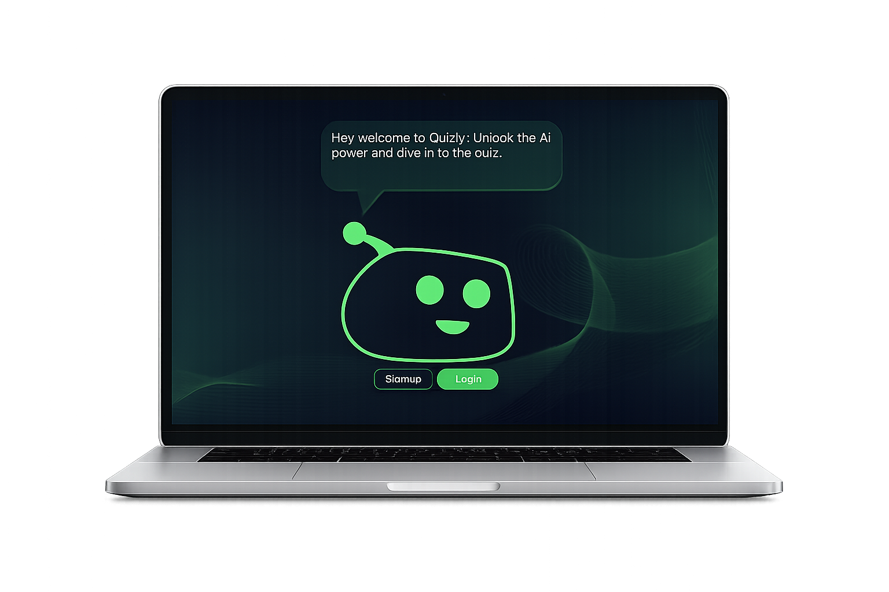
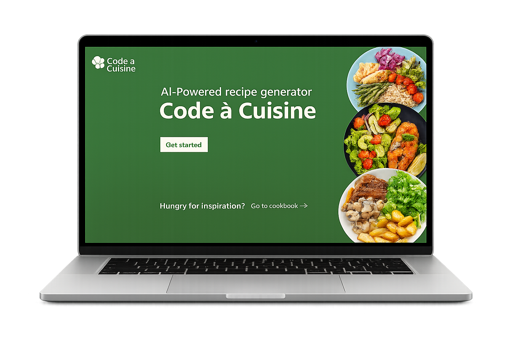
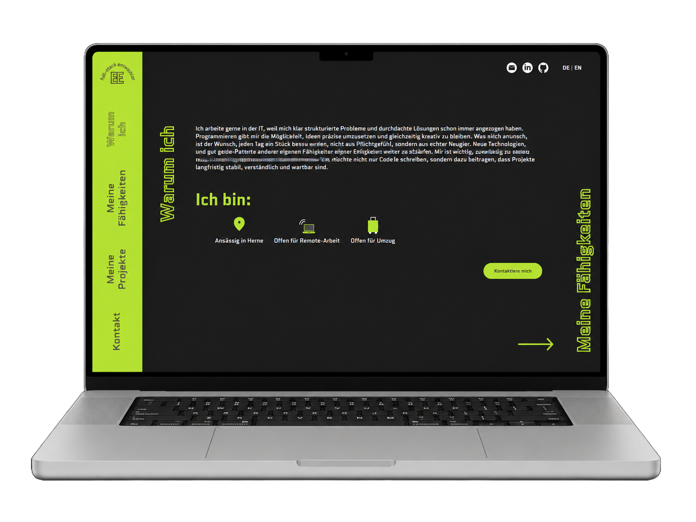
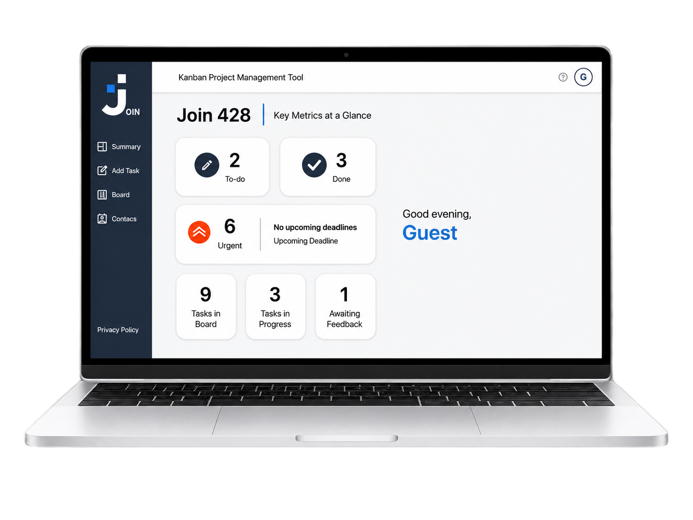
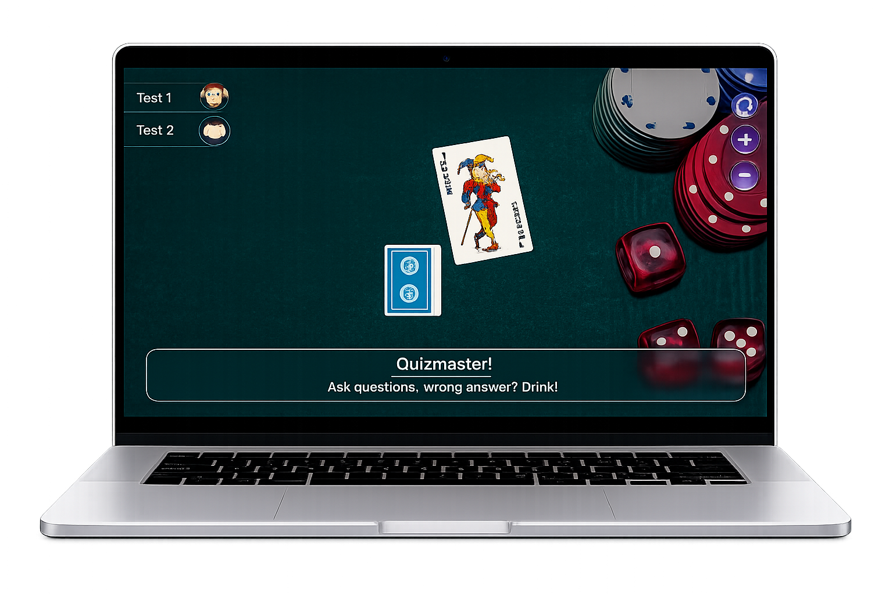

# Hi, I'm Ebubekir Elicora 👋

**Junior Full-Stack Developer · Angular · TypeScript · Python · Django**

---

## About Me

I am a career changer with a technical background in industrial mechanics and a completed full-stack development program.

I build complete web applications, from responsive and interactive frontends with **Angular, TypeScript and JavaScript** to REST backends with **Python, Django and Django REST Framework**. I also work with databases, authentication, APIs, Docker, Linux servers and cloud deployment.

- Based in Herne, Germany
- Full-stack development from frontend to backend
- Responsive interfaces and component-based architecture
- REST APIs, authentication and role-based permissions
- Databases, Docker, cloud deployment and Linux administration
- Clean, maintainable and documented code

---

## Tech Stack

### Frontend

### Backend, APIs & Data

### DevOps, Cloud & Workflow

---

## Featured Full-Stack Projects

<table>
  <tr>
    <td width="50%" valign="top">
      <h3 align="center">Coderr</h3>
      

        
      

      

        A full-stack marketplace where customers can discover and order digital services from registered business providers.
      

      

        <strong>Stack:</strong> JavaScript, HTML, CSS, Python, Django REST Framework, SQLite, Nginx, Gunicorn, and Google Cloud.
      

         
      

        <a href="https://coderr.ebubekir-elicora.de/">🌐 Live Demo</a>
        &nbsp;&nbsp;•&nbsp;&nbsp;
        <a href="https://github.com/EbubekirElicora/Coderr">📂 Repository</a>
      

    </td>
    <td width="50%" valign="top">
      <h3 align="center">Quizly</h3>
      

        
      

      

        An AI-powered full-stack quiz application that generates interactive quizzes from YouTube videos using speech transcription and generative AI.
      

      

        <strong>Stack:</strong> JavaScript, Python, Django REST Framework, JWT, Whisper, Gemini, FFmpeg, and Google Cloud.
      

      

        <a href="https://quizly.ebubekir-elicora.de/">🌐 Live Demo</a>
        &nbsp;&nbsp;•&nbsp;&nbsp;
        <a href="https://github.com/EbubekirElicora/Quizly">📂 Repository</a>
      

    </td>
  </tr>
  <tr>
    <td width="50%" valign="top">
      <h3 align="center">Code à Cuisine</h3>
      

        
      

        
      

        An AI-powered full-stack recipe application that generates personalized recipes through an Angular frontend, automated n8n workflows, and Firebase Firestore.
      

      

        <strong>Stack:</strong> Angular, TypeScript, Firebase Firestore, n8n, REST webhooks, and LLM integration.
      

         
      

        <a href="https://github.com/EbubekirElicora/code-a-cuisine">📂 Repository</a>
      

    </td>
    <td width="50%" valign="top">
      <h3 align="center">Developer Portfolio</h3>
      

        
      

      

        A responsive Angular portfolio that presents my projects, technical skills, professional background, and contact information.
      

      

        <strong>Stack:</strong> Angular 17, TypeScript, SCSS, RxJS, responsive design, and internationalization.
      

       
      

        <a href="https://ebubekir-elicora.de/">🌐 Live Demo</a>
        &nbsp;&nbsp;•&nbsp;&nbsp;
        <a href="https://github.com/EbubekirElicora/my-portfolio">📂 Repository</a>
      

    </td>
  </tr>
</table>

---

## Backend & Platform Projects

<table>
  <tr>
<td width="50%" valign="top">

<h3 align="center">Videoflix</h3>

  

  A Django REST backend for an authenticated video-streaming platform with
  account activation, password reset, background processing and adaptive HLS
  streaming.

  <strong>Stack:</strong> Django REST Framework, JWT, PostgreSQL, Redis,
  Docker, FFmpeg, HLS and background jobs

 

  <a href="https://videoflix.ebubekir-elicora.de/">🌐 Live Demo</a>
  &nbsp;&nbsp;•&nbsp;&nbsp;
  <a href="https://github.com/EbubekirElicora/Videoflix">
    📂 Repository
  </a>

</td>

<td width="50%" valign="top">

<h3 align="center">KanMind</h3>

  

  A task-management REST API with boards, members, tasks, comments,
  token authentication and detailed permission rules.

  <strong>Stack:</strong> Python, Django, Django REST Framework,
  token authentication and SQLite

  

  <a href="https://kanmind.ebubekir-elicora.de/">🌐 Live Demo</a>
  &nbsp;&nbsp;•&nbsp;&nbsp;
  <a href="https://github.com/EbubekirElicora/KanMind_BackEnd_Project">
    📂 Repository
  </a>

</td>
  </tr>
</table>

---

## Frontend Projects

<table>
  <tr>
<td width="33%" valign="top">

<h3 align="center">Join</h3>

  

  A Kanban-style task manager built with vanilla JavaScript,
  object-oriented architecture and drag-and-drop interactions.

 

  <a href="https://ebubekir-elicora.de/Join_428/html/log_in.html">
    🌐 Live Demo
  </a>
  &nbsp;&nbsp;•&nbsp;&nbsp;
  <a href="https://github.com/EbubekirElicora/join_428">
    📂 Repository
  </a>

</td>

<td width="33%" valign="top">

<h3 align="center">Ring of Fire</h3>

  

  An Angular and Firebase card game with real-time data synchronization
  and structured game-state management.

 

  <a href="https://ebubekir-elicora.de/ring-of-fire/">
    🌐 Live Demo
  </a>
  &nbsp;&nbsp;•&nbsp;&nbsp;
  <a href="https://github.com/EbubekirElicora/ringOfFire">
    📂 Repository
  </a>

</td>

<td width="33%" valign="top">

### El Pollo Loco

A browser-based 2D jump-and-run game built from scratch with object-oriented JavaScript and HTML5 Canvas.

[🌐 Live Demo](https://ebubekir-elicora.de/Projekt_El_Polo_Loco_Ebubekir_Elicora/index.html)  
[📂 Repository](https://github.com/EbubekirElicora/Projekt_El_Polo_Loco_Ebubekir_Elicora)

</td>
  </tr>
</table>

### More Projects

[Notes](https://github.com/EbubekirElicora/Firebase_Notes_Project) · [Simple CRM](https://github.com/EbubekirElicora/simple-crm) · [QuizApp](https://github.com/EbubekirElicora/QuizApp) · [Join Issue Collector](https://github.com/EbubekirElicora/Join_Issue_Collector)

---

## What I Work With

- Building responsive and component-based frontend applications
- Angular services, routing, forms, RxJS and state handling
- JavaScript and TypeScript application architecture
- Designing and implementing REST APIs
- Django models, serializers, views and permissions
- Token and JWT authentication
- SQL databases, PostgreSQL, SQLite, Redis and Firebase
- Docker, Linux, Nginx, Gunicorn and cloud deployment
- Git, GitHub, Postman and Scrum-based workflows

---

## Contact

I am open to junior full-stack, frontend, backend, application support and IT consulting opportunities.

- [LinkedIn](https://www.linkedin.com/in/ebubekir-eli%C3%A7ora-a27b47392/)
- [Portfolio](https://ebubekir-elicora.de/)
- [Email](mailto:ebubekirelicora@gmx.de)

---

**Thanks for visiting my profile.**

